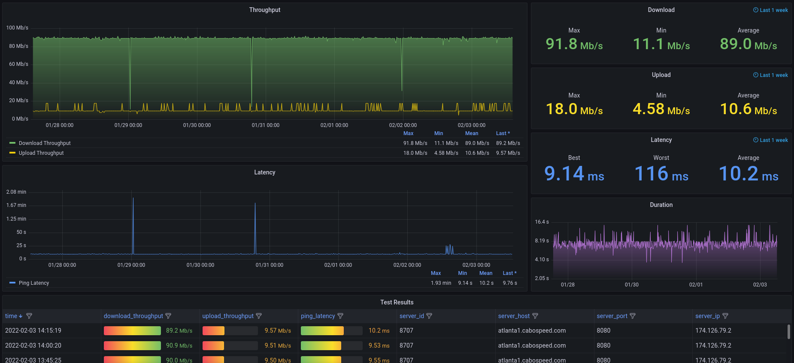

# Speedtest Monitor

A Python script to capture speedtest-cli JSON and insert it into a database.

## Getting Started

### About This Code
This script was written to track internet speed using Ookla's speed test.

This repository contains the SQL schema and the Grafana dashboard JSON so you can track your own metrics.

### Prerequisites
* [speedtest binary from Ookla](https://www.speedtest.net/apps/cli); I'm using the Linux binary here.
* MySQL database to store results.
* Set environment variables (see config.py).

#### Python Libraries
* See [pyproject.toml](pyproject.toml)

### Instructions For Use

* `python speedtest_monitor.py`

## Authors
* **Aaron Melton** - *Author* - Aaron Melton <aaron@aaronmelton.com>
